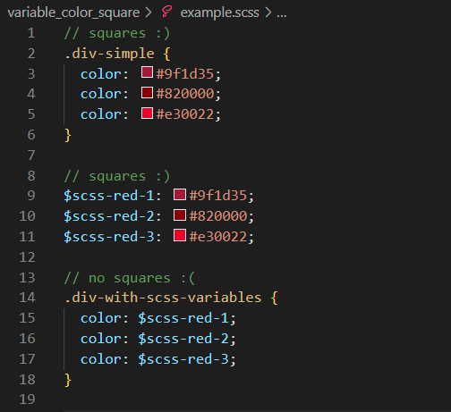

# VS Code CSS color issue

This repo describes issues related to color squares and color completion in VS Code.

All tests were done using the October 2022 version with extensions disabled.

 # Feature request to add color squares to CSS and SCSS variables

 # A bug in color completion, where color squares are missing

This bug occurs when there are variables of mixed sources, such as hex **and** RGB.

Backspacing resets the list so that the squares are displayed again.

I noticed this when copying and pasting `color: `. This suggests that the first autocompletion (at colon insertion) is related to this bug.

No bug when variables are hex-only.

# A bug in color completion, where variable names are file-scoped inconsistently

The mixed source file sees variables from the other file. The hex-only file does not.
